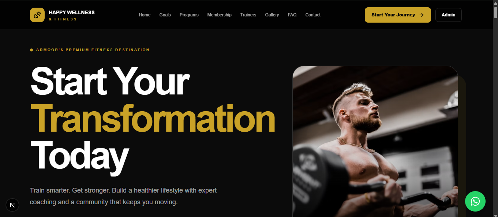
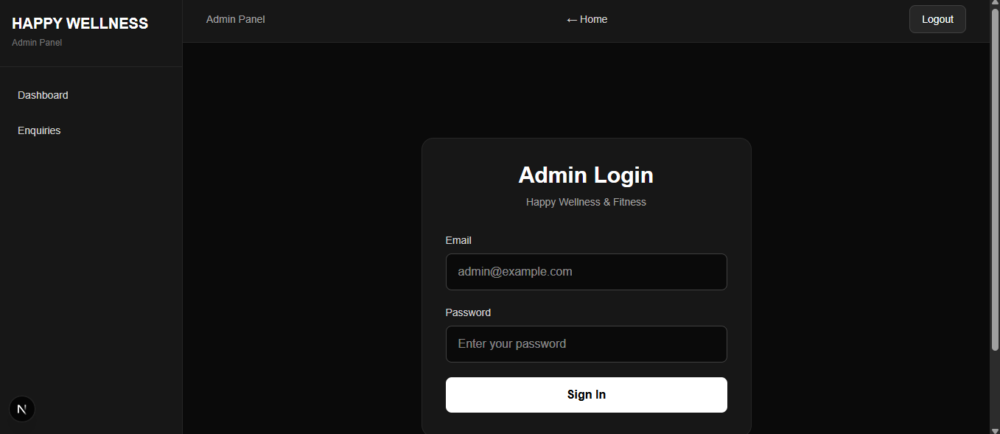
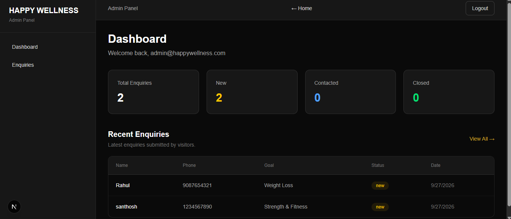
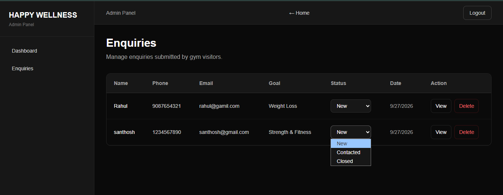
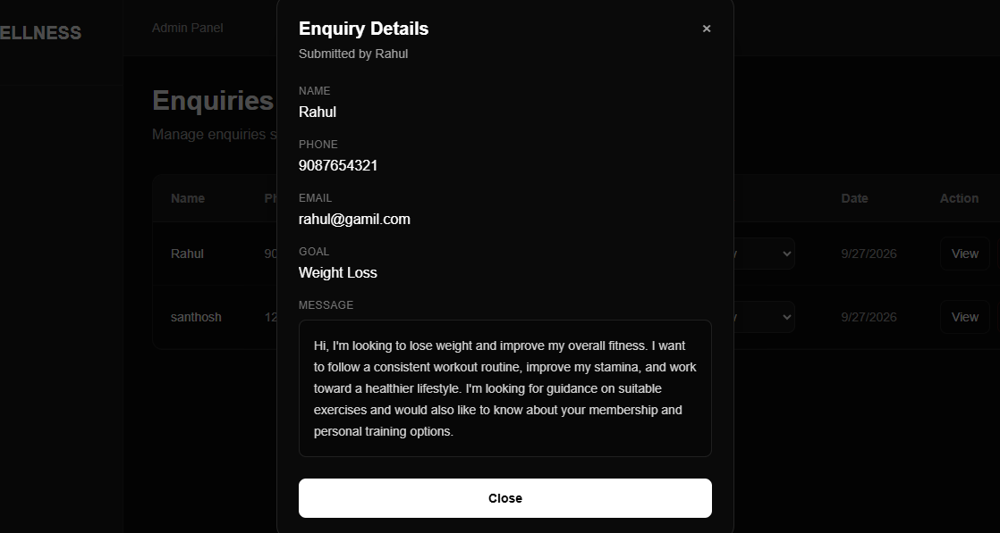

# Gym Website & Enquiry Management Portal

A reusable full-stack gym website and enquiry management portal built while learning and applying **Next.js** and **Supabase**.

The project combines a public-facing gym website with a protected admin portal where gym staff can manage enquiries submitted by visitors.

---

## 🚀 Features

### Public Website

- Modern responsive gym landing page
- Hero section with gym branding
- About section
- Services / workout programs
- Membership information
- Contact information
- Enquiry form
- Responsive navigation
- Mobile-friendly design

### Enquiry Portal

Visitors can submit enquiries through the website by providing:

- Name
- Phone number
- Email
- Fitness goal
- Message

Submitted enquiries are stored in a Supabase PostgreSQL database.

### Admin Portal

The project includes a protected admin area with:

- Admin login
- Authentication using Supabase Auth
- Protected admin routes
- Dashboard
- Enquiry statistics
- Recent enquiries
- Complete enquiry list
- View enquiry details
- Update enquiry status
- Delete enquiries
- Logout functionality
- Navigation back to the public website

### Enquiry Status Management

Each enquiry can have one of three statuses:

- New
- Contacted
- Closed

---

## 🛠️ Tech Stack

### Frontend

- Next.js
- React
- JavaScript / JSX
- Tailwind CSS

### Backend / Database

- Supabase
- PostgreSQL
- Supabase Authentication

### Other

- Git
- GitHub
- npm

---

## 🔐 Authentication

Admin authentication is handled using **Supabase Authentication**.

The admin login uses email and password authentication.

Protected routes prevent unauthenticated users from accessing:

```text
/admin/dashboard
/admin/enquiries
```

If an unauthenticated user tries to access these pages, they are redirected to:

```text
/admin/login
```

---

## 🗄️ Database

The application uses a Supabase PostgreSQL table named:

```text
Enquiry
```

The table contains:

| Column | Type | Description |
|---|---|---|
| id | uuid | Unique enquiry ID |
| name | text | Visitor name |
| phone | text | Visitor phone number |
| email | text | Visitor email |
| goal | text | Fitness goal |
| message | text | Visitor message |
| status | text | Enquiry status |
| created_at | timestamptz | Submission date and time |

The default enquiry status is:

```text
new
```

---

## 📸 Screenshots

### Public Website



### Enquiry Portal 


### Admin Login



### Admin Dashboard



### Enquiries



### Enquiry Details



---

## 📁 Project Structure

```text
gym-website-enquiry-portal/
│
├── app/
│   ├── admin/
│   │   ├── dashboard/
│   │   │   └── page.jsx
│   │   ├── enquiries/
│   │   │   └── page.jsx
│   │   ├── login/
│   │   │   └── page.jsx
│   │   └── layout.jsx
│   │
│   ├── globals.css
│   ├── layout.jsx
│   └── page.jsx
│
├── components/
│   ├── admin/
│   │   └── EnquiryTable.jsx
│   ├── EnquiryForm.jsx
│   ├── GymSections.jsx
│   └── ui/
│       └── button.tsx
│
├── config/
│   └── gym.js
│
├── lib/
│   ├── supabaseClient.js
│   ├── supabaseServer.js
│   └── utils.ts
│
├── public/
│
├── .env.local
├── .gitignore
├── next.config.mjs
├── package.json
├── package-lock.json
├── postcss.config.mjs
└── tsconfig.json
```

---

## ⚙️ Getting Started

### 1. Clone the repository

```bash
git clone https://github.com/srinilaya08/gym-website-enquiry-portal.git
```

### 2. Move into the project directory

```bash
cd gym-website-enquiry-portal
```

### 3. Install dependencies

```bash
npm install
```

### 4. Set up Supabase

Create a Supabase project and configure:

- Supabase Authentication
- Email authentication
- PostgreSQL database
- `Enquiry` table
- Required Row Level Security policies

### 5. Create environment variables

Create a `.env.local` file in the root directory:

```env
NEXT_PUBLIC_SUPABASE_URL=your_supabase_url
NEXT_PUBLIC_SUPABASE_PUBLISHABLE_KEY=your_supabase_publishable_key
```

Replace the values with your Supabase project credentials.

### 6. Start the development server

```bash
npm run dev
```

### 7. Open the application

Visit:

```text
http://localhost:3000
```

The public website will be available at:

```text
http://localhost:3000
```

The admin login will be available at:

```text
http://localhost:3000/admin/login
```

---

## 🔒 Environment Variables

The project uses environment variables for Supabase configuration.

The `.env.local` file is intentionally excluded from Git using `.gitignore`.

Never commit private credentials, service-role keys, passwords, or other secrets to the repository.

---

## 🔄 Application Workflow

```text
Visitor
   │
   ▼
Public Gym Website
   │
   ▼
Enquiry Form
   │
   ▼
Supabase PostgreSQL
   │
   ▼
Admin Dashboard
   │
   ├── View Enquiries
   ├── View Enquiry Details
   ├── Update Status
   └── Delete Enquiry
```

Admin authentication works separately:

```text
Admin
   │
   ▼
Admin Login
   │
   ▼
Supabase Authentication
   │
   ▼
Admin Dashboard
   │
   └── Enquiry Management
```

---

## 📚 What I Learned

This project was built as a practical learning project while exploring **Next.js** and **Supabase**.

Through this project, I worked with:

- Next.js App Router
- React components
- Client and Server Components
- Next.js layouts
- Route protection
- Supabase Authentication
- Supabase PostgreSQL
- Row Level Security
- Supabase JavaScript client
- Server-side Supabase client
- Environment variables
- CRUD operations
- Form handling
- Async operations
- Loading and error states
- Admin dashboard development
- Responsive UI development
- Git and GitHub

---

## 🎯 Project Purpose

The main purpose of this project was to learn how **Next.js works** and gain practical experience using **Supabase**.

I built this project from scratch to understand how Next.js can be used to create a modern web application and how Supabase can provide authentication and database functionality.

While building the project, I learned and practiced:

- Next.js App Router
- Pages and layouts
- Client and Server Components
- Routing and protected routes
- React components
- Form handling
- Supabase Authentication
- Supabase PostgreSQL database
- CRUD operations
- Row Level Security (RLS)
- Environment variables
- Connecting a Next.js application with Supabase
- Managing authenticated users
- Building an admin dashboard

The gym website was used as the practical project idea so I could learn these concepts by actually building and connecting different parts of the application rather than only following documentation or tutorials.

This project is also designed in a reusable way so the same structure can be adapted for different gyms or similar businesses in the future.

## 🔮 Future Improvements

Possible improvements for future versions include:

- Multiple admin accounts
- Role-based admin permissions
- Search and filtering for enquiries
- Pagination
- Enquiry analytics
- Email notifications
- WhatsApp integration
- Appointment scheduling
- Membership management
- Image management
- Gym-specific configuration through an admin panel
- Deployment and production setup

---

## 👨‍💻 Author

**Srinilaya Marripalli**

B.Tech Computer Science Engineering Student

### Profiles

- GitHub: https://github.com/srinilaya08
- LinkedIn: https://www.linkedin.com/in/srinilaya-marripalli-b66b92325/

---

## ⭐ Project

If you find this project useful or interesting, feel free to explore the repository and follow my development journey.
